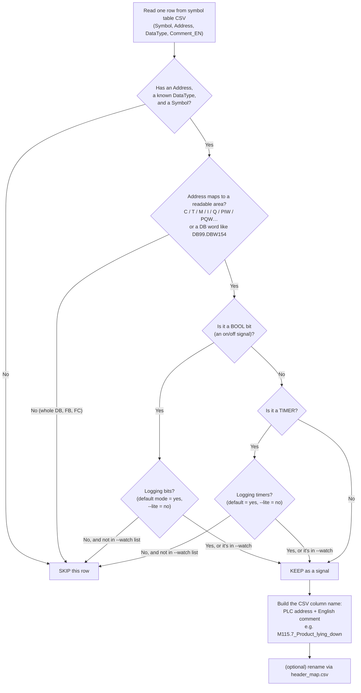
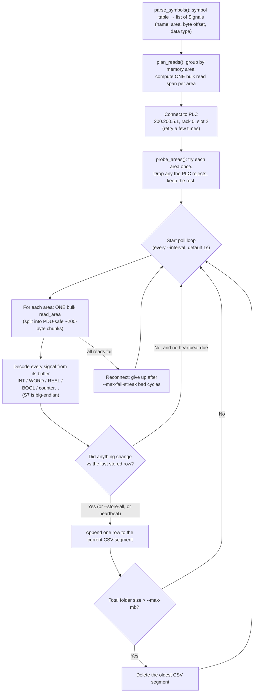

# PLC_data

Stream live signals off the L14 shrink-wrapper PLC (a Siemens S7-300) into a
rolling CSV you can analyse later. One script connects over the network, reads
the machine's values every second, and only writes a row when something changes.

---

## The one-paragraph version

`plc_comms.py` reads the machine's **exported symbol table** (a CSV listing every
named value, its PLC address, and its data type). For each named signal it works
out *where* the value lives in PLC memory and *how* to decode the raw bytes. It
then connects to the PLC, reads each block of memory in bulk once per second,
slices each signal out of that block, and appends a row to a CSV — but only if at
least one value differs from the last row it stored. Old CSV files are deleted
once the folder passes a size cap, so it can run forever without filling the disk.

---

## Files in this repo

| File | What it is |
|------|------------|
| `plc_comms.py` | The logger. Connects, reads, decodes, writes the rolling CSV. |
| `plc_watch.py` | A diagnostic. Watches PLC **Data Blocks** for a window and reports which 16-bit words actually move — used to tell live signals apart from static config. |
| `L14_shrinkwrapper_symbol_table_EN.csv` | The **source of truth**: every named PLC signal with `Symbol, Address, DataType, Comment_EN`. This is what decides which fields exist. |
| `L14_subset.csv` | A trimmed symbol table (same format) — a hand-picked shortlist if you only want a few signals. |
| `header_map.csv` | Optional `Address,Header` overrides to rename CSV columns to friendlier names. |
| `example_output.csv` | An example of what the logger produces (one `timestamp` column + one column per signal). |
| `L14 shrinkwrapper symbol table.pdf` | The original symbol table from the machine builder, before it was turned into the CSV. |
| `output/` | Where captured logs land: rolling `plc_00000001.csv`, `plc_00000002.csv`, … plus earlier capture sessions. |
| `../requirements.txt` | Repo-level dependencies; the logger itself only needs `python-snap7`. |

---

## How to run it

```bash
pip install -r requirements.txt

python plc_comms.py                     # log EVERYTHING (default), 1 row/sec on change
python plc_comms.py --lite              # numbers only: counters/analog/words, no on/off bits
python plc_comms.py --heartbeat 300     # also write one "still alive" row every 5 minutes
python plc_comms.py --symbols L14_subset.csv   # log only the shortlist
```

Stop with `Ctrl+C`. Data lands in this folder's `output/` as `plc_00000001.csv`,
`plc_00000002.csv`, … When the folder passes `--max-mb` (default 100 MB) the
oldest file is deleted.

Quick connection details, all overridable on the command line:

- **IP** `200.200.5.1`, **port** 102 (ISO-on-TCP / RFC 1006)
- **rack** 0, **slot** 2 (the S7-300 CPU sits in slot 2; slot 1 is the power supply)

---

## What gets logged, and how it's decided

Every field comes from a single row of the symbol table. The script walks those
rows and applies a small set of yes/no rules to decide whether to keep each one.

The two things it needs from each row:

- **`Address`** — e.g. `M 115.7` or `C 7`. The **prefix** (`M`, `C`, `T`, `I`,
  `Q`, `PIW`, `PQW`…) says which area of PLC memory to read. The number says where
  in that area.
- **`DataType`** — e.g. `BOOL`, `INT`, `REAL`, `COUNTER`. Says how to turn raw
  bytes back into a number or a true/false.



The headline rules:

- **Default = log everything**, including the on/off **bits** (`M`/`I`/`Q`). That's
  deliberate — the fault and state signals (fallen product, jams, axis faults)
  live in those bits.
- **`--lite`** drops bits and timers, leaving the numeric signals only.
- **`--watch M115.7,M100.7`** force-keeps specific addresses even under `--lite`.
- **Whole Data Blocks (`DB`/`FB`/`FC`) are skipped** — most hold static config.
  But a symbol-table row that names a **specific DB word/bit** is logged like any
  other signal: give it an address such as `DB99.DBW154` (byte offset) and a real
  `DataType` (`INT`, `WORD`, `DINT`, `REAL`, or `BOOL` for `DBX10.3`). That's how
  the recipe/format setpoints (film-under-pack `DB99.DBW154`, speed-correction
  `DB99.DBW158`) get captured. Use `plc_watch.py` to find which DB words move.
- The **column header** is the PLC address plus its English description, so a
  column maps straight back to the address an engineer would quote on the floor
  (`M115.7`, `C7`, …).

---

## How it actually reads the PLC

Once the field list is fixed, the script doesn't read signals one at a time —
that would be hundreds of network round-trips per second. Instead it **groups
signals by memory area** and reads each whole area in one shot, then slices each
signal out of that buffer.



Key decisions in this loop:

- **One read per area, not per signal.** All `M` signals share one read of Merker
  memory; all counters share one read of the counter area, and so on.
- **Reads are chunked** to stay under the PLC's ~222-byte message limit, so a
  large area is fetched as several safe pieces and stitched back together.
- **Change-of-value storage.** A row is written only when a value moved. An idle
  line barely grows the file. `--heartbeat N` adds a liveness row every N seconds;
  `--store-all` records every poll.
- **Forward-fill on load.** Each stored row holds until the next one. To rebuild a
  per-second table in pandas: `df.set_index("timestamp").ffill()`.
- **Self-healing.** If an area can't be read at startup it's dropped with a warning
  and the rest keep logging. If all reads fail mid-run it reconnects, and only
  gives up after a long streak of failures.

---

## Memory-area cheat sheet

How an address prefix maps to the S7 memory area the script reads:

| Address prefix | Memory area | Holds |
|----------------|-------------|-------|
| `C` | CT (counters) | pack counts, runtime minutes — decoded from BCD |
| `T` | TM (timers) | timer values |
| `M`, `MW`, `MD`, `MB` | MK (Merker / flags) | machine state + **fault bits** |
| `I`, `PIW` | PE (process inputs) | sensor inputs, analog inputs |
| `Q`, `PQW` | PA (process outputs) | drive control words, speed setpoints |
| `DB99.DBW154` | DB (data block) | recipe/format setpoints — only when a row names a specific word/bit |
| whole `DB` / `FB` / `FC` | — | **not read** (static config / recipes) |
